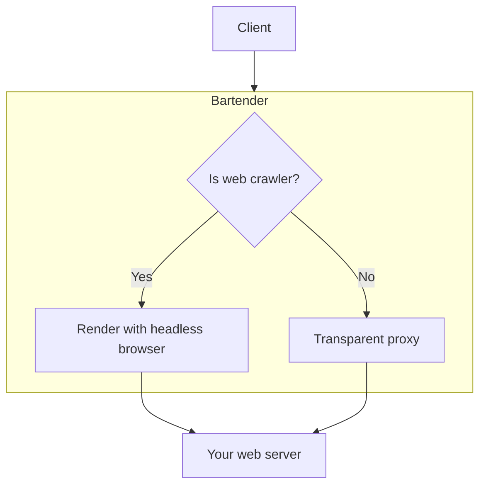
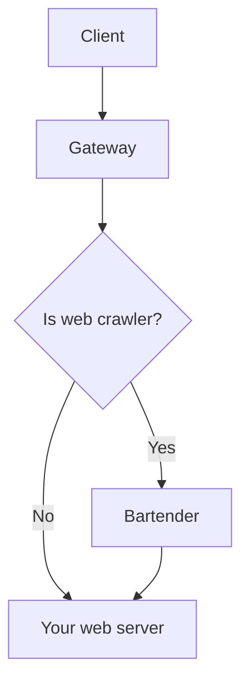

# Overview

It's design to make SEO for single page application easier, so that you don't have to use Server-side rendering tricks.

It acts like a transparent http proxy by default, it only actives when the client looks like a web crawler, such as Googlebot, Baiduspider, etc.

## Installation

You can simplify use bartender as the gateway in front of your web server:

```bash
docker run -p 3000:3000 bartender ./serve -p :3000 -t http://your-web-server:8080
```

A common data flow looks like this:



If you want the best performance, you can install bartender behind a gateway like nginx, configure the gateway to proxy the request to bartender when the client looks like a web crawler.

A common way to detect web crawler: [link](https://stackoverflow.com/a/2517444/1089063).

A common data flow looks like this:


